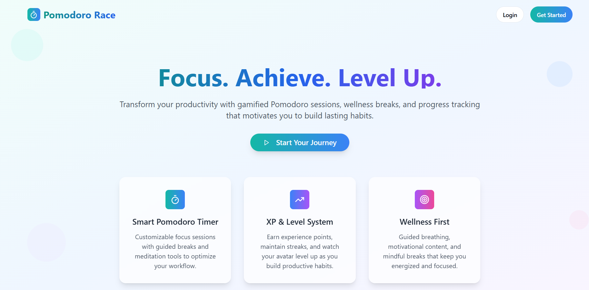
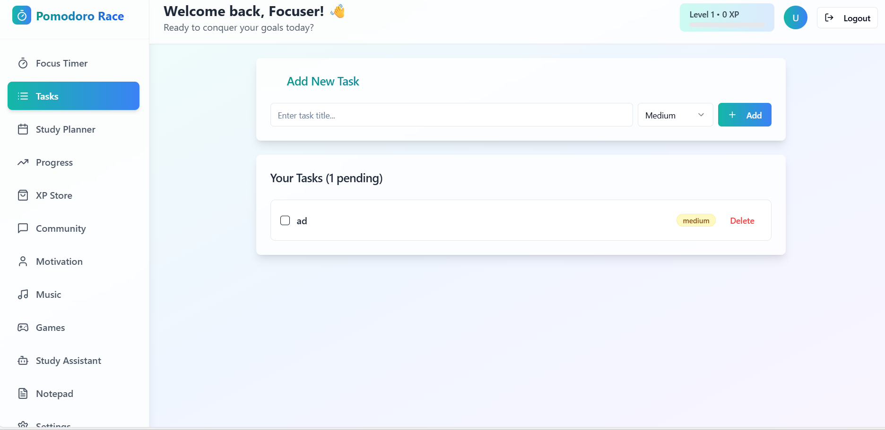
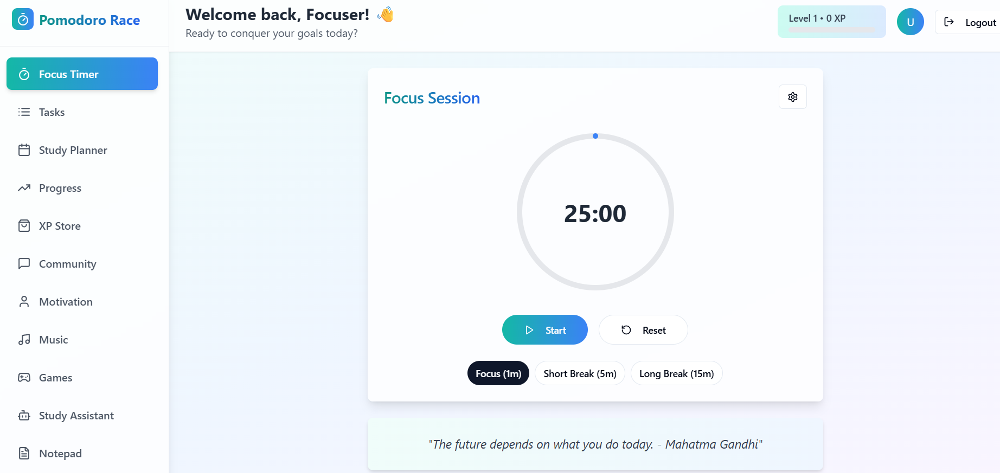
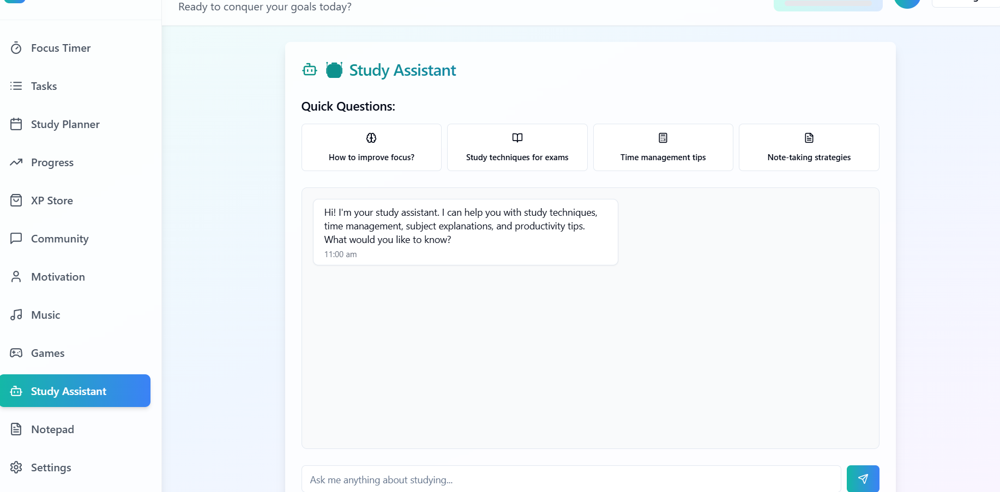

# ⏳ Pomodoro Habit Race

> A gamified productivity and habit tracking web application that combines the Pomodoro Technique with habit streaks, daily goals, race-style motivation, and analytics to help users stay consistent and productive.


---

# 🚀 Live Demo

🌐 **Live Website:** `https://your-live-link.com`

📂 **Frontend Repository:** `https://github.com/yourusername/pomodoro-habit-race`

---

# 📌 Table of Contents

* [About the Project](#-about-the-project)
* [Features](#-features)
* [Tech Stack](#-tech-stack)
* [System Architecture](#-system-architecture)
* [Screenshots](#-screenshots)
* [Project Workflow](#-project-workflow)
* [Installation](#-installation)
* [Environment Variables](#-environment-variables)
* [Folder Structure](#-folder-structure)
* [How It Works](#-how-it-works)
* [Core Functionalities](#-core-functionalities)
* [Future Enhancements](#-future-enhancements)
* [Challenges Faced](#-challenges-faced)
* [Learning Outcomes](#-learning-outcomes)
* [Performance & Optimization](#-performance--optimization)
* [Contributing](#-contributing)
* [License](#-license)
* [Author](#-author)

---

# 📖 About the Project

Pomodoro Habit Race is a modern productivity application designed to help users improve focus, consistency, and discipline using a combination of:

* ⏱️ Pomodoro Timer
* 📈 Habit Tracking
* 🔥 Daily Streaks
* 🏆 Productivity Race System
* 📊 Analytics Dashboard
* 🎯 Goal Tracking

The application transforms productivity into a game-like experience where users compete against themselves by maintaining streaks, completing Pomodoro sessions, and tracking habits daily.

This project was built to solve common problems students and professionals face:

* Procrastination
* Lack of consistency
* Poor focus management
* Difficulty tracking progress
* Low motivation during long-term goals

By integrating habit tracking with Pomodoro productivity cycles, the app encourages sustainable productivity instead of burnout.

---

# ✨ Features

## ⏳ Pomodoro Timer

* Start / Pause / Reset timer
* Custom focus session duration
* Short break & long break support
* Session completion notifications
* Auto cycle between work and break sessions

## 📅 Habit Tracker

* Create daily habits
* Track completion progress
* Habit streak calculation
* Mark habits as completed
* View historical progress

## 🏁 Habit Race System

* Gamified race interface
* Earn points based on consistency
* Daily productivity scoring
* Streak-based rewards
* Competitive progress visualization

## 📊 Analytics Dashboard

* Total focus time
* Productivity charts
* Habit completion statistics
* Weekly and monthly insights
* Session analytics

## 👤 User Authentication

* Secure login/signup system
* JWT-based authentication
* Protected routes
* User-specific dashboard

## 🎨 Modern UI/UX

* Responsive design
* Smooth animations
* Clean dashboard layout
* Mobile-friendly interface
* Interactive productivity cards

## 🔔 Smart Notifications

* Session completion alerts
* Habit reminders
* Daily goal reminders
* Productivity motivation prompts

---

# 🛠 Tech Stack

## Frontend

* React.js
* JavaScript
* HTML5
* CSS3
* Tailwind CSS
* Framer Motion
* Axios
* React Router DOM

## Backend

* Node.js
* Express.js
* MongoDB
* Mongoose
* JWT Authentication
* bcrypt.js

## Tools & Deployment

* Git & GitHub
* VS Code
* Vercel / Netlify (Frontend)
* Render / Railway (Backend)
* Postman

---

# 🏗 System Architecture

```text
┌────────────────────┐
│    Frontend UI     │
│     React.js       │
└─────────┬──────────┘
          │ API Calls
          ▼
┌────────────────────┐
│   Express Server   │
│   REST API Layer   │
└─────────┬──────────┘
          │
          ▼
┌────────────────────┐
│     MongoDB        │
│   Database Layer   │
└────────────────────┘
```

---

# 📸 Screenshots

## 🏠 Home Page



---

## ⏳ Pomodoro Timer



---

## 📊 Analytics Dashboard



---

## 📅 Habit Tracker




---

# 🔄 Project Workflow

```text
User Login/Register
        ↓
Access Dashboard
        ↓
Start Pomodoro Session
        ↓
Complete Focus Session
        ↓
Gain Productivity Points
        ↓
Track Habit Completion
        ↓
Maintain Daily Streaks
        ↓
View Analytics & Progress
```

---

# ⚙️ Installation

## 1️⃣ Clone the Repository

```bash
git clone https://github.com/yourusername/pomodoro-habit-race.git
```

## 2️⃣ Navigate to Project Directory

```bash
cd pomodoro-habit-race
```

## 3️⃣ Install Frontend Dependencies

```bash
cd frontend
npm install
```

## 4️⃣ Install Backend Dependencies

```bash
cd backend
npm install
```

---

# 🔑 Environment Variables

Create a `.env` file inside the backend folder:

```env
PORT=5000
MONGO_URI=your_mongodb_connection_string
JWT_SECRET=your_secret_key
NODE_ENV=development
```

---

# ▶️ Run the Project

## Start Backend Server

```bash
cd backend
npm run dev
```

## Start Frontend

```bash
cd frontend
npm start
```

---

# 📂 Folder Structure

```text
pomodoro-habit-race/
│
├── frontend/
│   ├── public/
│   ├── src/
│   │   ├── components/
│   │   ├── pages/
│   │   ├── context/
│   │   ├── services/
│   │   ├── hooks/
│   │   ├── assets/
│   │   └── App.js
│   └── package.json
│
├── backend/
│   ├── controllers/
│   ├── routes/
│   ├── models/
│   ├── middleware/
│   ├── config/
│   ├── server.js
│   └── package.json
│
└── README.md
```

---

# ⚡ How It Works

## 1. User Authentication

Users can securely register and log in to the platform. JWT authentication ensures secure access to user-specific productivity data.

## 2. Pomodoro Session Management

The Pomodoro timer helps users divide work into focused intervals. Each completed session increases productivity scores.

## 3. Habit Tracking

Users can add habits such as:

* Reading
* Coding
* Exercise
* Meditation
* Study sessions

Daily completion updates streaks and statistics.

## 4. Race Mechanism

The productivity race system motivates users to maintain consistency through:

* XP points
* Daily streaks
* Session milestones
* Achievement tracking

## 5. Analytics Engine

The dashboard analyzes:

* Focus hours
* Weekly performance
* Habit consistency
* Productivity growth trends

---

# 🔥 Core Functionalities

## ⏱️ Timer Logic

* Countdown implementation
* Auto-switching between sessions
* Pause/resume handling
* Notification triggers

## 📈 Habit Streak Algorithm

* Consecutive day calculation
* Progress persistence
* Streak reset detection

## 🔐 Authentication System

* Password hashing
* JWT token generation
* Protected route middleware
* Secure session handling

## 📊 Dashboard Analytics

* Data aggregation
* Chart rendering
* Progress statistics
* Session history tracking

---

# 🚀 Future Enhancements

* 🌙 Dark/Light Theme Toggle
* 👥 Multiplayer Productivity Races
* 📱 Mobile Application
* 🤖 AI Productivity Suggestions
* 🔔 Smart Push Notifications
* ☁️ Cloud Sync Support
* 🧠 Focus Music Integration
* 📅 Google Calendar Integration
* 🏅 Achievement & Badge System
* 📊 Advanced Productivity Reports

---

# 🧩 Challenges Faced

During development, several challenges were encountered:

* Managing accurate timer synchronization
* Maintaining real-time productivity tracking
* Handling authentication securely
* Designing an engaging gamified UI
* Optimizing dashboard performance
* Managing state across multiple components

These challenges helped improve problem-solving and full-stack development skills.

---

# 📚 Learning Outcomes

This project helped in gaining hands-on experience with:

* Full Stack Web Development
* REST API Development
* Authentication Systems
* Database Design
* State Management
* Responsive UI Design
* Productivity Application Architecture
* Real-world Project Deployment

---

# ⚡ Performance & Optimization

The application includes several optimizations:

* Lazy loading components
* Optimized API calls
* Efficient state management
* Responsive image handling
* Fast page rendering
* MongoDB query optimization

---

# 🧪 Testing

## Manual Testing

* Authentication testing
* Timer functionality testing
* Habit CRUD testing
* Dashboard validation
* Mobile responsiveness testing

## API Testing

* Postman used for backend API validation
* Authentication endpoint testing
* CRUD operation verification

---

# 🌍 Deployment

## Frontend Deployment

The frontend can be deployed using:

* Vercel
* Netlify

## Backend Deployment

The backend can be deployed using:

* Render
* Railway
* Cyclic

## Database Hosting

* MongoDB Atlas

---

# 🤝 Contributing

Contributions are welcome!

## Steps to Contribute

1. Fork the repository
2. Create a new branch
3. Commit your changes
4. Push to your branch
5. Create a Pull Request

```bash
git checkout -b feature-name
```

---


# 👨‍💻 Author

## Manas Ippalpalli

🎓 B.Tech Student
💻 Full Stack Developer
🤖 AI & Generative AI Enthusiast


---

# ⭐ Support

If you found this project helpful:

⭐ Star the repository
🍴 Fork the project
📢 Share with others

---

# 💡 Final Note

Pomodoro Habit Race is more than just a productivity tool — it is a system designed to help users build discipline, maintain consistency, and transform productivity into a rewarding experience.

By combining time management techniques with habit-building psychology and gamification, this project demonstrates how technology can positively influence daily routines and personal growth.

---

# ⭐ Thank You For Visiting The Repository!
